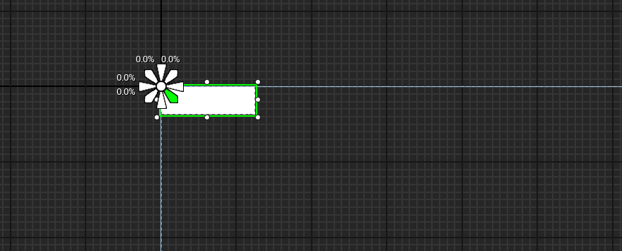

# Virtual Joystick

## How to Set-Up

### in designer setup


you can either follow the video bellow or the instructions


**1 -** open your [Widget Blueprint](../creating-hud-widget-blueprint.md)

**2 -** Go to designer mode

**3 -** In palette window under user created section locate `WBP_MCK_JoystickComponent` or type directly in the search bar

**4-** After locating it drag it into the hierarchy under[CanvasPanel](../info.md) ... ⓘ

**5-** in the hierarchy select the `WBP_MCK_JoystickComponent` then in the Details window :

* check the `is variable` box
* name the component to any thing that make sense for you (name it Joystick1 for this docs example)

**6 -** anchor it to any place you want , by pressing control and left click on one of the anchors pin and drag (better set all offsets to 0)

<figure><figcaption></figcaption></figure>

**7 -** in the details window go to appearance dropdown then to Color And Opacity and set the Alpha to 0 To make the component invisible

**8 -** in details window setup the properties that appear :

* **required :** these are important to set
  * joystick background :
  * joystick thumb :
  * joystick sprint thumb :
* **For Customization Component :** if you are using HUD customization component it's important to set these values
  * Min Opacity : player can't go bellow this opacity when editing HUD(set something between 0-1)
  * Min [Sprint length](#user-content-fn-1)[^1] : the minimum sprint length that player can set when editing
  * Max [Sprint length](#user-content-fn-2)[^2] : the maximum sprint length that player can set when editing
  * Min Joystick [size ](#user-content-fn-3)[^3]: the minimum joystick size that player can set when editing
  * Max Joystick [size ](#user-content-fn-4)[^4]: the maximum joystick size that player can set when editing



[!embed](https://blueprintue.com/render/smrae6zj/)

### in graph setup

after setting the joystick component in the designer view switch to Graph editor and follow the instructions bellow

1. select

[^1]: is the length the player need to swipe his thumb to start sprinting "from center of joystick to top middle is 1 unit "

[^2]: is the length the player need to swipe his thumb to start sprinting "from center of joystick to top middle is 1 unit "

[^3]: NOTE : this size is same size that you can edit when setting button inside canvas panel that is anchored to one point

[^4]: NOTE : this size is same size that you can edit when setting button inside canvas panel that is anchored to one point
